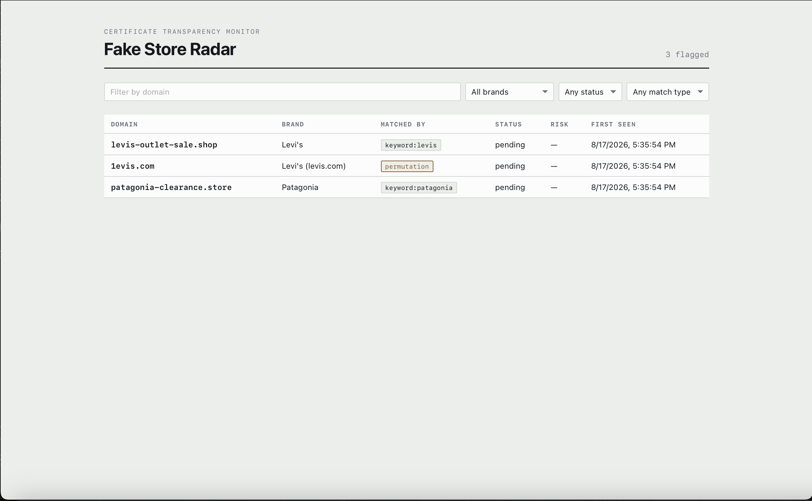

# Fake Store Radar

Detects fraudulent lookalike retail storefronts in real time by streaming Certificate Transparency logs, matching newly issued certificates against typosquat permutations of real brand domains, and surfacing the hits in a filterable dashboard.



## The problem

When a scammer sets up a fake Levi's or Nike storefront, the first public trace is almost always a TLS certificate. Every certificate issued by a public CA is written to Certificate Transparency logs within seconds — an append-only, publicly auditable record that exists so browsers can detect misissuance.

That record is also an early-warning system. A domain like `levis-outlet-sale.shop` appears in the CT stream the moment its certificate is issued, typically days before the site is fully built and long before it starts taking card details. Fake Store Radar watches that stream and flags candidates as they appear.

## How it works

```
CertStream (CT logs)
        │
        ▼
  ingest consumer ──── watchlist ──── dnstwist permutations
        │                             + brand keywords
        ▼
    Postgres  ──────►  FastAPI  ──────►  React dashboard
   (candidates)         /api             (filter + triage)
```

**Ingest.** A consumer subscribes to the CT firehose and inspects the SAN list of every certificate. Matching happens in memory against a precomputed set — around 31,000 permutations for ten brands — so the hot loop stays O(1) per domain and keeps pace with the stream.

**Matching.** Two paths. Permutation matching uses `dnstwist` to generate typo variants of each brand's real domain (homoglyph substitution, omission, repetition, TLD swaps), catching things like `1evis.com` where the letter `l` is replaced with the digit `1`. Keyword matching catches brand names embedded in longer domains — `levis-outlet-sale.shop` — that no permutation set would produce. Every candidate records *which* path matched it, so false positives are debuggable.

**Storage.** Candidates are upserted with `ON CONFLICT DO NOTHING` on the domain, so repeated observations of the same certificate renewal are free. Evidence is stored as JSONB, which lets the scoring stage add new signals without a migration each time.

**API.** FastAPI exposes the candidate set with composable filters — brand, status, match type, first-seen window, domain substring — validated at the type level and documented automatically at `/docs`.

**Dashboard.** React + TypeScript, with types generated directly from the API's OpenAPI schema rather than hand-written, so backend changes surface as compile errors instead of runtime surprises. Domains are set in monospace throughout: `1evis.com` and `levis.com` are nearly indistinguishable in a proportional face, and the interface's entire job is making that difference visible.

## Stack

| Layer | Tools |
|---|---|
| Ingest | Python, certstream, dnstwist |
| Storage | PostgreSQL 16, SQLAlchemy 2.0, Alembic |
| API | FastAPI, Pydantic v2 |
| Frontend | React, TypeScript, Vite, TanStack Query |
| Infra | Docker Compose (Postgres, Redis) |

## Running it locally

Requires Docker, Python 3.12+, and Node 20+.

**1. Start the datastores**

```bash
git clone https://github.com/AdrasAyman/fake-store-radar.git
cd fake-store-radar
docker compose up -d
```

**2. Set up the backend**

```bash
cd backend
python -m venv .venv && source .venv/bin/activate
pip install -r requirements.txt
cp ../.env.example .env
```

Fill in `.env`. `DATABASE_URL` and `CERTSTREAM_URL` have working defaults. On macOS you also need `SSL_CERT_FILE`, because Python doesn't use the system trust store and the CertStream websocket will fail TLS verification without it:

```bash
python -m certifi   # paste the printed path into SSL_CERT_FILE
```

**3. Create the schema and seed brands**

```bash
alembic upgrade head
python -m scripts.seed_brands
```

**4. Verify the detection pipeline offline**

```bash
python -m app.ingest --replay-file tests/fixtures/sample_stream.jsonl
```

Expect three matches and one correctly ignored domain. Replay mode reads recorded CT messages from a JSONL file, which makes the matching logic testable without depending on a live upstream.

**5. Run the API**

```bash
uvicorn app.main:app --reload
```

Interactive docs at http://localhost:8000/docs.

**6. Run the dashboard**

```bash
cd ../frontend
npm install
npm run gen:api        # regenerates TS types from the running API
npm run dev
```

http://localhost:5173.

**7. Optionally, stream live**

```bash
cd ../backend && python -m app.ingest
```

New detections appear in the dashboard within 15 seconds without a reload.

## Project layout

```
backend/
  app/
    api/         FastAPI routes and Pydantic schemas
    core/        settings, database session, dependencies
    ingest/      CertStream consumer, watchlist, permutation generation
    models/      SQLAlchemy models
  alembic/       migrations
  scripts/       brand seeding
  tests/         fixtures and unit tests
frontend/
  src/api/       generated types + fetch client
  src/App.tsx    dashboard
```

## Scope and safety

This is a detection and reporting tool. It identifies domains that resemble known brands and records public evidence about them; it does not interact with, disrupt, or attack anything it finds.

- Suspected fraudulent sites are crawled in a disposable container, never a host browser profile. Scam storefronts serve drive-by payloads, and crawl artifacts are treated as untrusted input.
- Reference screenshots of legitimate brand sites are fetched at a low rate, with `robots.txt` respected.
- Certificate Transparency logs are public by design; no authentication is bypassed and no private data is collected.
- A permutation match is a signal, not a verdict. Plenty of lookalike domains are defensive registrations by the brand itself, resellers, or fan sites. Risk scoring exists to rank candidates for human review, not to replace it.

## Known limitations

- The public `certstream.calidog.io` relay is unreliable — it accepts websocket connections but intermittently delivers no messages. Self-hosting `certstream-server-go` is tracked as an open issue.
- Risk scoring and crawling are not implemented yet, so every candidate currently sits at `pending` with a null score.
- The watchlist is seeded from a static list of ten apparel brands.

## Roadmap

- **v0.2 — Crawler.** Celery workers pull pending candidates, load each in a hardened Playwright context, and capture screenshots, DOM, response headers, and TLS metadata.
- **v0.3 — Scoring.** Perceptual hash distance against the brand's real homepage, logo asset matching, DOM structural similarity, presence of a card-collecting form, domain age via RDAP, registrar and ASN reputation. Weighted into a risk band, with every signal retained in `evidence` so the dashboard can explain the score.
- **v0.4 — Alerts.** Per-brand alert rules with email and SMS delivery, deduplicated so one domain doesn't page repeatedly.
- **v0.5 — Natural-language query.** Translate questions like "Levi's lookalikes from this week with a live payment form" into filtered queries over the candidate set.

## License

MIT